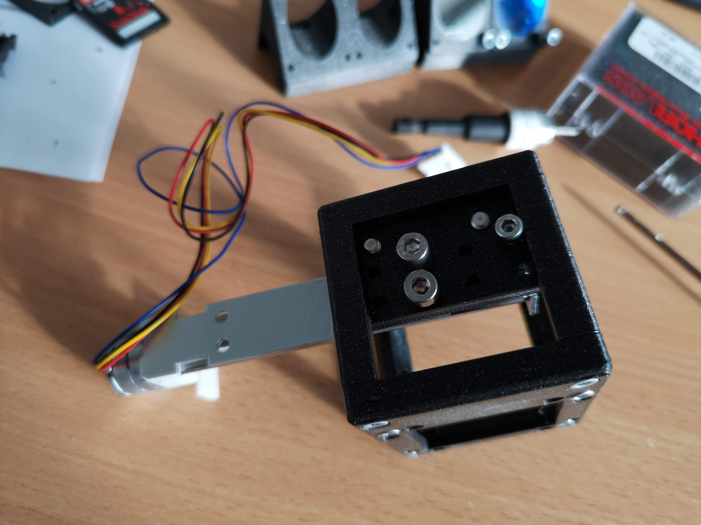
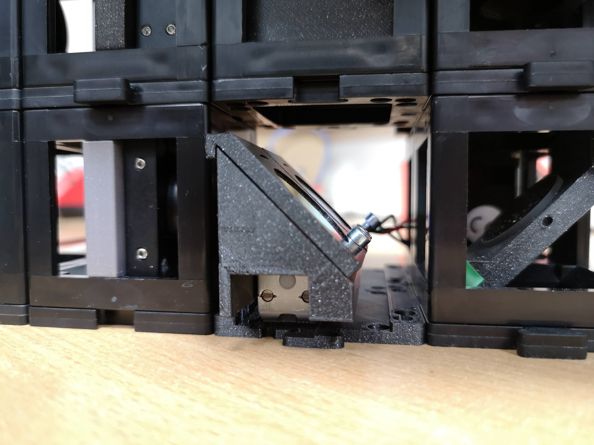
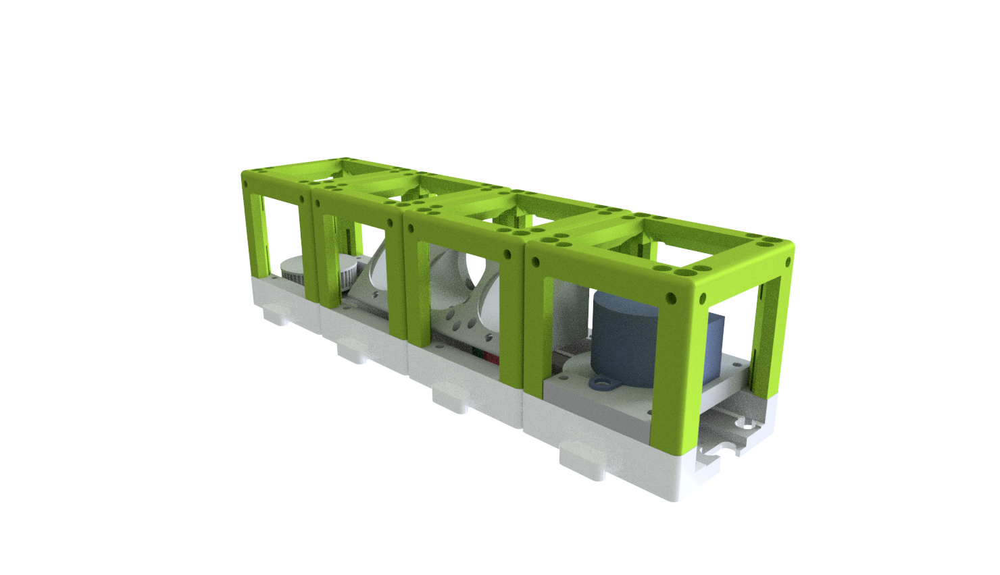

# openUC2 Multicolour Fluorescence 

Here we present some modules that will help you to first join different laser/light sources using a tunable dichroic mirror and linear dichroic filter switchers. Both modules can direclty snap into the UC2 system.
Curious to see what this looks like? Scroll to the very bottom of the page.

**Figure 1:** *(From-left-to-right) Compact linear filter switch that mounts the way that a beam couples from "behind"; same filter switcher, but beam enters from above; Laser beam combiner*

***Features:***
* Switch flourescence filters/dichroics linearly
* Align two beams w.r.t. each other
* Low-cost
* Integrate into the UC2 system

## In-Action

The filter switcher basically works like the one below. This version is deprecated, but the principle remains the same. 

# Software

## Firmware 

The laser control and motion of the filter is done by the [UC2-REST](https://github.com/openUC2/UC2-REST) firmware. It is a work-in-progress and we suggest you to reach out to us through an issue when you're keen on using the software

## GUI/Controlsoftware

We forked the beautiful [ImSwitch](https://github.com/kasasxav/ImSwitch/) and adapted many functionalities (e.g. Filter swtichting) into their framework. The [beniroquai fork](https://github.com/beniroquai/ImSwitch/) implements the above mentioned Firmware [UC2-REST](https://github.com/openUC2/UC2-REST). Also here: It is a work-in-progress and we encourage you to reach out to us if you need help. :-)

## Python Code

A ESP32-Python client to control the motors that are connected to e.g. the CNC-Shield v3 can be found here [ESP32Client.py](https://github.com/openUC2/UC2-REST/blob/master/PYTHON/ESP32Client.py).

# Hardware - Beamcombiner

Below we describe how the device can be build and assembled in order to replicate the whole system as shown in the rendering above. One needs additional parts that can be found in the core [openUC2 repository](https://github.com/openUC2/UC2-GIT).

## Bill of material

Below you will find all components necessary to build the beamcombiner

### 3D printing files

All these files in the folder [./STL/Beamcombiner](./STL/Beamcombiner) need to be printed. We used a Prusa i3 MK3 using PLA Prusament (Galaxy Black) at layer height 0.3 mm and infill 30%.

Additionally you need 1x Cube.

### Additional parts
This is used in the current version of the setup

|  Type | Details  |  Price | Link  |
|---|---|---|---|
| Dichroic mirror | Depending on your two wavelengths (25mm diameter or 25x16mm, chosoe adapter accordingly) |  10-100 € | [Comar](https://www.comaroptics.com/components/filters/dichroic-filters/long-pass-dichroic-filters)  |
| (optional) Fiber coupled laser | Depending on your system (e.g. MiCost, see SQUID paper) |  10-100 € | [MiCost](micost.com)  |
| (optional) Fiber adapter | 2x Thorlabs SM1FC |  15 € | [Thorlabs](Thorlabs.com)  |
| M3 screws | For kinematic mounting (non magnetic will be ok) |  1 € | [various](amazon.com)  |
| O-ring | 2x to add backtracing force; 10-15mm diameter |  1 € | [various](amazon.com)  |

### Design files
The original design files are in the [INVENTOR](./INVENTOR) folder. 

### Electronics
We develop a dedicated Electronics module called [UC2 Feather](https://github.com/openUC2/UC2_Feather/). Alternatively you can use an ESP32 Wemos d32 in conjuction with an CNC Shield v3.

### Assembly of the DEVICE

***1.*** *These are the parts needed for the DEVICE*

***2.*** *Start by adding the filter to the holder*


***3.*** *Add screws everywhere and also add the o-rings* Hint: The screws have been moved to an 45° angle to provide better force ratio (?); If thisneeds more explanation please reach out to us. Hint2: The screws should be pointed so that they fit into the 3D printed grooves from the kinematic mount!

***4.*** *Add the fiber mounts *

***5.*** *Add the laser fibers*

***6.*** *Align the two beams so that the two circles match perfectly at various places along the optical axis* Hint: Laser safety!

***7.*** *DONE! LOOK AT THE BEAUTY!*

# Hardware - Beamcombiner

Below we describe how the device can be build and assembled in order to replicate the whole system as shown in the rendering above. One needs additional parts that can be found in the core [openUC2 repository](https://github.com/openUC2/UC2-GIT).

## Bill of material

Below you will find all components necessary to build the beamcombiner

### 3D printing files

All these files in the folder [./STL/Beamcombiner](./STL/Beamcombiner) need to be printed. We used a Prusa i3 MK3 using PLA Prusament (Galaxy Black) at layer height 0.3 mm and infill 30%.

Additionally you need 1x Cube.

### Additional parts
This is used in the current version of the setup

|  Type | Details  |  Price | Link  |
|---|---|---|---|
| Dichroic mirror | Depending on your two wavelengths (25mm diameter or 25x16mm, chosoe adapter accordingly) |  10-100 € | [Comar](https://www.comaroptics.com/components/filters/dichroic-filters/long-pass-dichroic-filters)  |
| (optional) Fiber coupled laser | Depending on your system (e.g. MiCost, see SQUID paper) |  10-100 € | [MiCost](micost.com)  |
| (optional) Fiber adapter | 2x Thorlabs SM1FC |  15 € | [Thorlabs](Thorlabs.com)  |
| M3 screws | For kinematic mounting (non magnetic will be ok) |  1 € | [various](amazon.com)  |
| O-ring | 2x to add backtracing force; 10-15mm diameter |  1 € | [various](amazon.com)  |

### Design files
The original design files are in the [INVENTOR](./INVENTOR) folder. 

### Electronics
We develop a dedicated Electronics module called [UC2 Feather](https://github.com/openUC2/UC2_Feather/). Alternatively you can use an ESP32 Wemos d32 in conjuction with an CNC Shield v3.

### Assembly of the DEVICE

***1.*** *These are the parts needed for the DEVICE*

***2.*** *Start by adding the filter to the holder*


***3.*** *Add screws everywhere and also add the o-rings* Hint: The screws have been moved to an 45° angle to provide better force ratio (?); If thisneeds more explanation please reach out to us. Hint2: The screws should be pointed so that they fit into the 3D printed grooves from the kinematic mount!

***4.*** *Add the fiber mounts *

***5.*** *Add the laser fibers*

***6.*** *Align the two beams so that the two circles match perfectly at various places along the optical axis* Hint: Laser safety!

***7.*** *DONE! LOOK AT THE BEAUTY!*

# Hardware - Filterswitcher

Below we describe how the device can be build and assembled in order to replicate the whole system as shown in the rendering above. One needs additional parts that can be found in the core [openUC2 repository](https://github.com/openUC2/UC2-GIT).

## Bill of material

Below you will find all components necessary to build the filterswitcher

### 3D printing files

All these files in the folder [./STL/Beamcombiner](./STL/Beamcombiner) need to be printed. We used a Prusa i3 MK3 using PLA Prusament (Galaxy Black) at layer height 0.1 mm and infill 100%.
For the filter mount it is important to place this surface on the print bed surface so that it is perfectly flat. This way you can make sure that all dichroics are mounted under the same angle. 

Additionally you need several Cubes.

*Here the beam enters from above (or below, depending on the orientation) and will be reflected horizontally*

*Here the beam enters from the side and will be reflected vertically (good for inverted microscopes)*

***HINT***:  you can have 3 filters too

### Additional parts
This is used in the current version of the setup

|  Type | Details  |  Price | Link  |
|---|---|---|---|
| Dichroic mirror | Depending on your two wavelengths (25mm diameter o) |  10-200 € | [Thorlabs](thorlabs.com)  |
| Emission filter | Depending on your two wavelengths (25mm diameter o) |  10-200 € | [Thorlabs](thorlabs.com)  |
| Linear Motor | DC 12V Hub 80mm 
Stepper Screw 2-Phase |  10-100 € | [Amazon](https://www.amazon.de/gp/product/B07X6J8C3T/ref=ox_sc_act_title_1?smid=A119AWRA5YL9T1&psc=1)  |
| M3 screws | For kinematic mounting (non magnetic will be ok) |  1 € | [various](amazon.com)  |
| O-ring | 2x to add backtracing force; 10-15mm diameter |  1 € | [various](amazon.com)  |

### Design files
The original design files are in the [INVENTOR](./INVENTOR) folder. 

### Electronics
We develop a dedicated Electronics module called [UC2 Feather](https://github.com/openUC2/UC2_Feather/). Alternatively you can use an ESP32 Wemos d32 in conjuction with an CNC Shield v3.

### Assembly of the DEVICE

***1.*** *These are the parts needed for the DEVICE*




Here moves the motor, glue the white pin to the filterholder


***2.*** Mount the Slide with M3 screws to the Cube

***3.*** Add the filters with additional M3 screws

***4.*** Add this to the setup

## Showcase

Here we present a z-stack of infected epithelia cells with two different colours (GFP+AF647).

### In a setup

***Inside an upright microscope.***

The filter is hanging here. 

## Deprecated

In older releases, we were working on these designs:

### Filter revolver

- could be very fast
- never "on-axis"
- every filter has a different angle w.r.t. the incoming beam
- hard to align

### Linear filter with MGN12 slide

- could be very precise
- slow motor
- complicated to build 
- low-cost 
- a bit wiggely w.r.t the angle for each position (too compact 

## Further reading
- Low-cost stage scanner: [PLoS One](https://journals.plos.org/plosone/article?id=10.1371/journal.pone.0194063)
- MicroscoPi: [Biorxiv](https://micronoxford.com/microscopi-3d-printed-1)
- Incubot: [HardwareX](https://www.sciencedirect.com/science/article/pii/S2468067221000183)
- Opentrons [Website](www.opentrons.com)
- OpenFlexure Microscope [Website](https://openflexure.org/)
- openUC2 [Github](https://github.com/openUC2/)

## Get Involved

This project is open so that anyone can get involved. You don't even have to learn CAD designing or programming. Find ways you can contribute in  [CONTRIBUTING](CONTRIBUTING.md)

## License and Collaboration

This project is open-source and is released under the CERN open hardware license. Our aim is to make the kits commercially available.
We encourage everyone who is using our Toolbox to share their results and ideas, so that the Toolbox keeps improving. It should serve as a easy-to-use and easy-to-access general purpose building block solution for the area of STEAM education. All the design files are generally for free, but we would like to hear from you how is it going.

You're free to fork the project and enhance it. If you have any suggestions to improve it or add any additional functions make a pull-request or file an issue.

Please find the type of licenses [here](./License.md)

REMARK: All files have been designed using Autodesk Inventor 2019 (EDUCATION)

## Credits
If you find this project useful, please like this repository, follow us on Twitter and cite the webpage! :-)
